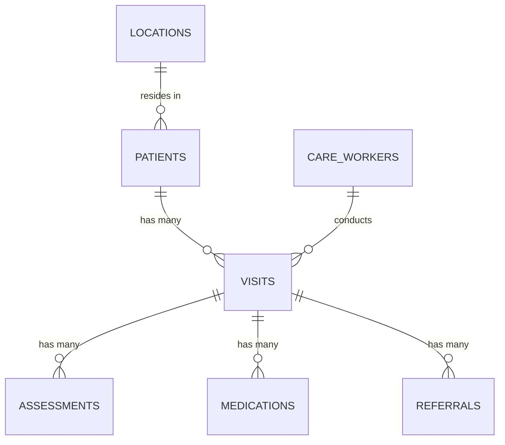

# Database Schemas

This folder contains entity-relationship (ER) diagrams and schema documentation for the RHHJ database.

## Contents

| File | Description |
|------|-------------|
| [`screening-schema.md`](screening-schema.md) | Table descriptions, column reference, ER diagram, and design decisions for the cervical-cancer screening tables |
| `er-diagram.png` | Entity-relationship diagram (add once full schema is finalised) |

## Screening Module — Implemented Tables

The first schema module covers the cervical-cancer **screening** workflow,
derived from the 2024 and 2025 screening Excel records.
See [`screening-schema.md`](screening-schema.md) for full documentation.

```
screening_sessions            — one outreach / clinic event at a named site
screening_records             — one patient record per session
screening_session_summaries   — age-group breakdown per session
monthly_screening_summaries   — month × site aggregate (Annual Summary sheets)
```

## Future Tables (planned)

Based on the program's home-based care workflow, the following additional
tables are anticipated.  Field names and types will be confirmed after
reviewing the remaining data-structure documents.

```
patients          — Patient demographics, registration date, diagnosis
care_workers      — Staff / volunteer profiles and contact details
locations         — Villages, parishes, and districts in the catchment area
visits            — Record of each home visit (date, care_worker, patient)
assessments       — Clinical observations recorded during a visit
medications       — Medications prescribed or administered
referrals         — Referrals to other health facilities
documents         — Linked files / photos stored in Supabase Storage
```

## ER Diagram (Mermaid placeholder — future modules)


