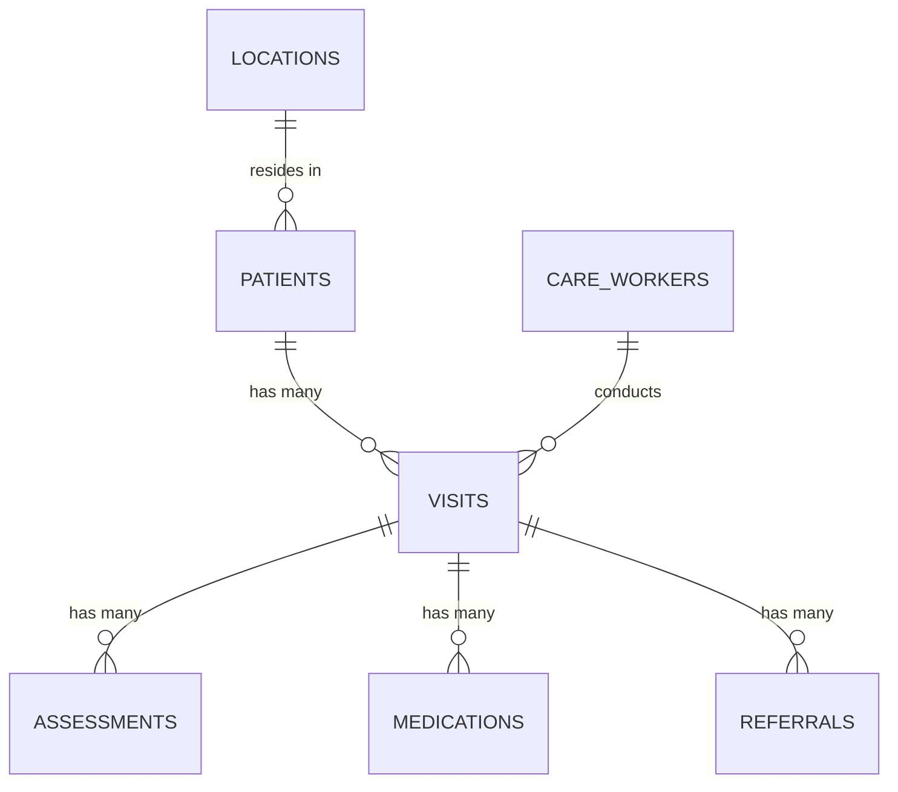

# Database Schemas

This folder contains entity-relationship (ER) diagrams and schema documentation for the RHHJ database.

## Contents

| File | Description |
|------|-------------|
| `er-diagram.png` | Entity-relationship diagram (add once schema is finalised) |
| `schema-overview.md` | Narrative description of all tables and their relationships |

## Proposed Core Tables

Based on the program's home-based care workflow, the following tables are anticipated.
Final field names and types will be confirmed after reviewing the data-structure documents.

```
patients          — Patient demographics, registration date, diagnosis
care_workers      — Staff / volunteer profiles and contact details
locations         — Villages, parishes, and districts in the catchment area
visits            — Record of each home visit (date, care_worker, patient)
assessments       — Clinical observations recorded during a visit
medications       — Medications prescribed or administered
referrals         — Referrals to other health facilities
documents         — Linked files / photos stored in Supabase Storage
```

## ER Diagram (Mermaid placeholder)


