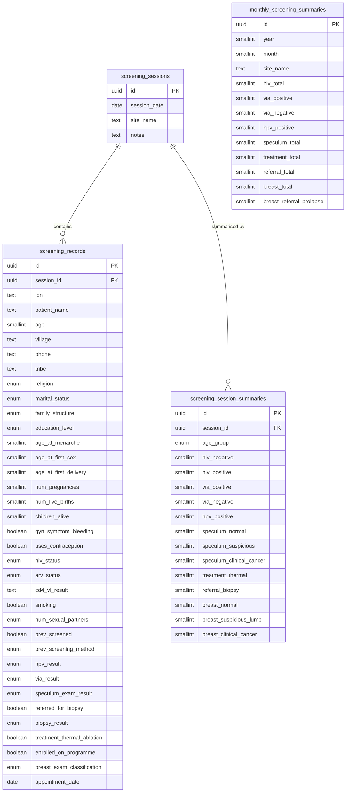

# Screening Schema — Overview

This document describes the database tables created by
[`../migrations/001_create_screening_tables.sql`](../migrations/001_create_screening_tables.sql)
for the RHHJ cervical-cancer screening programme.

The schema is derived from two Excel reference files:

| File | Sheets |
|------|--------|
| `docs/data-structures/Screening Record 2024 final.xlsx` | 88 site-data sheets + paired Summary sheets + Annual Summary |
| `docs/data-structures/Screening 2025.xlsx` | 76 site-data sheets + paired Summary sheets + General Annual Summary 2025 |

---

## Data Hierarchy

```
screening_sessions  (one outreach / clinic event at a site)
  │
  ├── screening_records  (one patient record per session)
  │
  └── screening_session_summaries  (age-group breakdown per session)

monthly_screening_summaries  (month × site aggregate — Annual Summary sheets)
```

---

## Table Descriptions

### `screening_sessions`
One row per **screening event** — an outreach visit to a health centre, school,
community site, or the RHHJ clinic on a specific date.

| Column | Type | Notes |
|--------|------|-------|
| `id` | UUID PK | Auto-generated |
| `session_date` | DATE | Date the screening took place |
| `site_name` | TEXT | e.g. "Kangulamira HCIV", "RHHJ Clinic", "Buyende Field Office" |
| `notes` | TEXT | Optional free text |
| `created_at` | TIMESTAMPTZ | |
| `updated_at` | TIMESTAMPTZ | |

---

### `screening_records`
One row per **patient** per session. Derived from the wide per-site data sheets
(e.g. "Kangulamira 301", "Buyende Jan").

#### Patient Identification

| Column | Type | Notes |
|--------|------|-------|
| `id` | UUID PK | Auto-generated |
| `session_id` | UUID FK | → `screening_sessions.id` |
| `ipn` | TEXT UNIQUE | Internal Patient Number. Format: `S###/YY` (2024) or `<SiteCode>####/YY` (2025) |
| `patient_name` | TEXT | |
| `age` | SMALLINT | Age in years at time of screening |
| `village` | TEXT | |
| `phone` | TEXT | |
| `tribe` | TEXT | |

#### Demographics

| Column | Type | Allowed Values |
|--------|------|----------------|
| `religion` | ENUM | Catholic, Protestant, Muslim, Saved, Other |
| `marital_status` | ENUM | Single, Married, Cohabiting, Divorced, Widowed |
| `family_structure` | ENUM | Monogamous, Polygamous |
| `education_level` | ENUM | None, Primary, Secondary, Tertiary |

#### Gynecological History

| Column | Type | Notes |
|--------|------|-------|
| `age_at_menarche` | SMALLINT | Age at first menstrual period |
| `age_at_first_sex` | SMALLINT | Age at first sexual contact |
| `age_at_first_delivery` | SMALLINT | Age at first delivery |
| `num_pregnancies` | SMALLINT | Total pregnancies |
| `num_live_births` | SMALLINT | |
| `children_alive` | SMALLINT | |

#### Gynecological Symptoms (checkbox flags)

| Column | Type | Excel Label |
|--------|------|-------------|
| `gyn_symptom_none` | BOOLEAN | No symptoms |
| `gyn_symptom_bleeding` | BOOLEAN | Bleed. |
| `gyn_symptom_discharge` | BOOLEAN | Disch. |
| `gyn_symptom_growth` | BOOLEAN | Growth |
| `gyn_symptom_urinary` | BOOLEAN | Urinary |
| `gyn_symptom_pain` | BOOLEAN | Pain |

#### Contraception

| Column | Type | Notes |
|--------|------|-------|
| `uses_contraception` | BOOLEAN | N (FALSE) or Y (TRUE) on form |

#### HIV Status

| Column | Type | Allowed Values |
|--------|------|----------------|
| `hiv_status` | ENUM | Negative, Positive, Unknown |
| `arv_status` | ENUM | Not on ARV, 1st Line, 2nd Line — populated only when `hiv_status = 'Positive'` |
| `cd4_vl_result` | TEXT | Free-text CD4 count or viral-load value |
| `cd4_vl_date` | DATE | Date of CD4 / VL test (`month since test` in 2024; `Date tested` in 2025) |
| `cd4_vl_unknown` | BOOLEAN | Set TRUE when patient does not know their result |

#### Risk Factors

| Column | Type | Notes |
|--------|------|-------|
| `smoking` | BOOLEAN | History of smoking. Explicitly captured on the 2024 form; NULL-able for 2025 |
| `num_sexual_partners` | ENUM | None, 1-3, 4-6, 7-9, 10+ |

#### Previous Cervical Screening

| Column | Type | Allowed Values |
|--------|------|----------------|
| `prev_screened` | BOOLEAN | Yes / No |
| `prev_screening_method` | ENUM | VIA, HPV, PAP, Histology, Other (HPV added in 2025 form) |
| `prev_screening_result` | ENUM | Negative, Positive |

#### Current Screening Results

| Column | Type | Notes |
|--------|------|-------|
| `hpv_result` | ENUM | Positive / Not Done. HPV DNA test added to 2025 form; NULL for 2024 records |
| `via_result` | ENUM | Positive / Negative / Declined |
| `speculum_exam_result` | ENUM | Normal / Suspicious / Clinical Cancer / Other / Not Done |

#### Biopsy

| Column | Type | Notes |
|--------|------|-------|
| `referred_for_biopsy` | BOOLEAN | |
| `biopsy_referral_location` | TEXT | Where patient was referred |
| `biopsy_result` | ENUM | Positive / Negative / Referred for PAP Smear |

#### Treatment Given (checkbox flags)

| Column | Type | Excel Label |
|--------|------|-------------|
| `treatment_cryotherapy` | BOOLEAN | Cryo |
| `treatment_thermal_ablation` | BOOLEAN | Thermal |
| `treatment_antibiotics` | BOOLEAN | Antibiotics |
| `treatment_referred_mulago` | BOOLEAN | Refer to Mulago |
| `enrolled_on_programme` | BOOLEAN | Enrlled on programme |

#### Breast Examination

| Column | Type | Notes |
|--------|------|-------|
| `breast_lump_found` | BOOLEAN | Lump found on self-exam |
| `prev_breast_screened` | BOOLEAN | |
| `prev_breast_screening_when` | TEXT | Months or free-text date |
| `prev_breast_result` | TEXT | Free-text Positive / Negative |
| `breast_result_today` | TEXT | VIA-style Positive / Negative result |
| `breast_biopsy_needed` | BOOLEAN | |
| `breast_exam_classification` | ENUM | Normal / Suspicious Lump / Clinical Cancer / Unknown |

#### Enrollment and Follow-up

| Column | Type | Notes |
|--------|------|-------|
| `appointment_date` | DATE | |
| `follow_up` | TEXT | Free-text follow-up note (e.g. "After biopsy") |

---

### `screening_session_summaries`
Age-group breakdown for a single session. Derived from the paired
`<Site> Summary` sheet (e.g. "Kangulamira Summary", "Buyende Jan Summary").

One row per age group per session.

| Age Group | Range |
|-----------|-------|
| `<19` | Under 19 years |
| `20-30` | 20–30 years |
| `31-40` | 31–40 years |
| `41-50` | 41–50 years |
| `51-60` | 51–60 years |
| `>61` | 61 years and over |

Columns follow the same category groupings as `screening_records` aggregates:
HIV status counts, VIA results, HPV results, speculum exam results, treatment
given, referrals, and breast exam results.  See the migration SQL for the
complete column list.

---

### `monthly_screening_summaries`
Site-level monthly aggregate row. Derived from the "Annual Summary" sheet
(2024 workbook) and the "General Annual Summary 2025" / "RHHJ Monthly Summary"
sheets (2025 workbook).

One row per `(year, month, site_name)`.

Columns mirror the category groupings in `screening_session_summaries`, plus
`breast_referral_prolapse` which was added on the 2025 Annual Summary sheet.

---

## Entity-Relationship Diagram



---

## Key Design Decisions

### 1. Wide Boolean Flags vs. Arrays for Checkboxes
The Excel forms use multiple checkbox columns for grouped fields (e.g.
symptoms, treatment given). These are stored as individual BOOLEAN columns
rather than a TEXT[] array to preserve type safety, simplify querying, and
allow future indexing on individual flags.

### 2. Handling 2024 vs. 2025 Form Differences
| Difference | Design choice |
|-----------|---------------|
| `smoking` field only on 2024 form | Column retained; NULL-able — set for 2024 records, NULL for 2025 |
| `HPV` added to previous-screening methods in 2025 | Added `'HPV'` to `prev_screening_method_type` enum |
| `hpv_result` (current test) added in 2025 | Column retained; NULL-able |
| `Prolapse` referral column added in 2025 Annual Summary | `breast_referral_prolapse` added to `monthly_screening_summaries` only |
| IPN format changed (`S###/YY` → `<SiteCode>####/YY`) | Single free-text `ipn` column; unique constraint enforced |

### 3. Aggregate vs. Individual Record Storage
Both individual records (`screening_records`) and pre-computed summaries
(`screening_session_summaries`, `monthly_screening_summaries`) are stored.
Individual records can generate the same aggregates via GROUP BY queries, but
historically only summary-level data may be available for many 2024 sessions;
storing summaries separately avoids lossy data migration.

### 4. Source Form Misspellings
The Excel forms contain several consistent misspellings that appear in column
headers.  Import scripts must normalize these to the correct enum values:

| Excel Label | Correct Value |
|-------------|---------------|
| `Clincal Cancer` | `'Clinical Cancer'` |
| `Enrlled on programme` | enrolled flag = TRUE |
| `Biopys` | maps to `referral_biopsy` / `breast_referral_biopsy` columns |
| `MAMOGRAM` | maps to `breast_referral_mammogram` column |

See [`../../docs/data-structures/screening-data-dictionary.md`](../../docs/data-structures/screening-data-dictionary.md)
for the complete column-by-column mapping.

### 5. Row-Level Security
All tables have RLS enabled. Access policies should be added in a subsequent
migration once Supabase roles (care worker, supervisor, admin) are defined.
