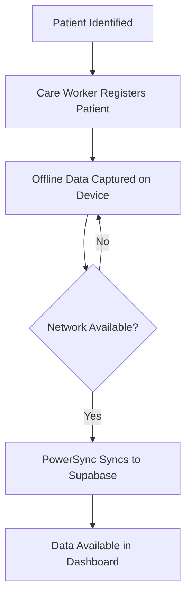

# Process Diagrams

Place workflow diagrams and process flow charts in this folder.

## Suggested Diagrams

| File Name | Description |
|-----------|-------------|
| `patient-registration-flow.png` | Steps from initial patient identification to registration |
| `home-visit-workflow.png` | Care worker home visit process |
| `data-sync-flow.png` | How data flows from the mobile app through PowerSync to Supabase |
| `system-architecture.png` | High-level system architecture diagram |

## Tools

Recommended diagramming tools:
- [draw.io / diagrams.net](https://app.diagrams.net) — free, exports to PNG/SVG/XML
- [Lucidchart](https://lucidchart.com) — collaborative, exports to PNG/PDF
- [Mermaid](https://mermaid.js.org) — diagrams-as-code in Markdown files

## Mermaid Example

You can embed diagrams directly in Markdown files using Mermaid syntax:

